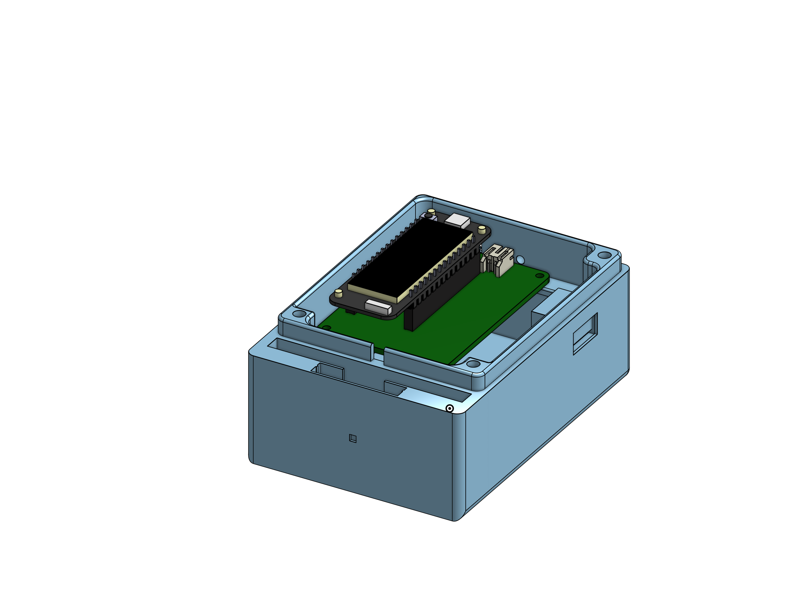
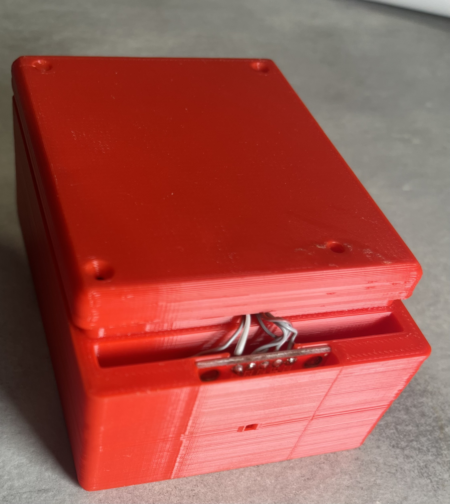
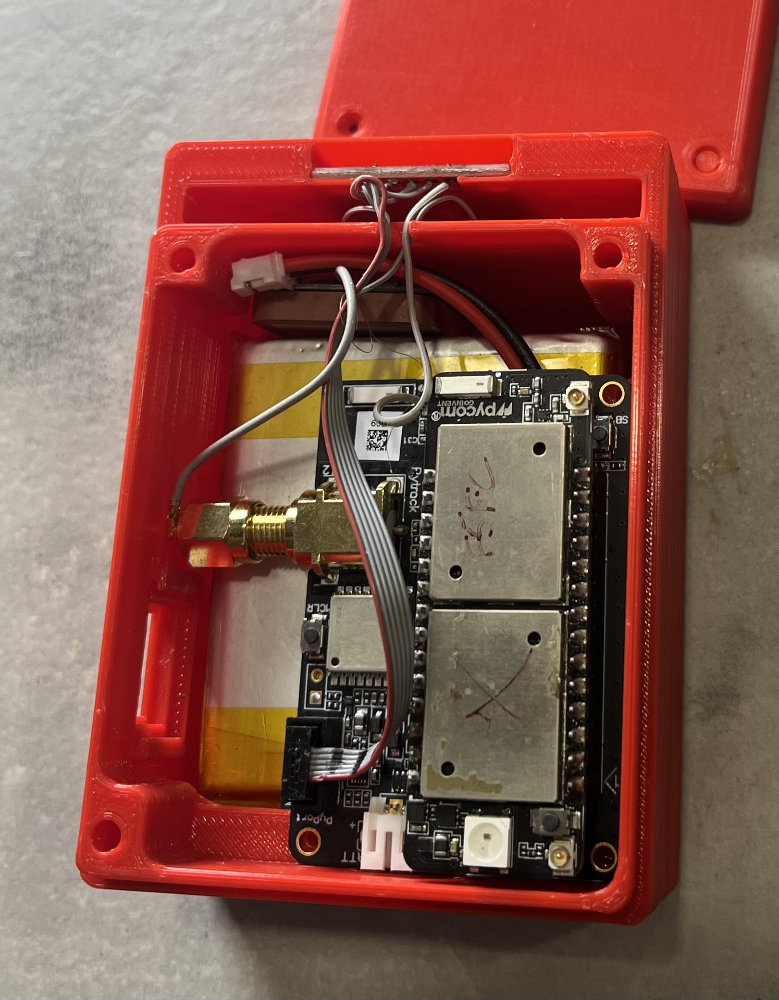
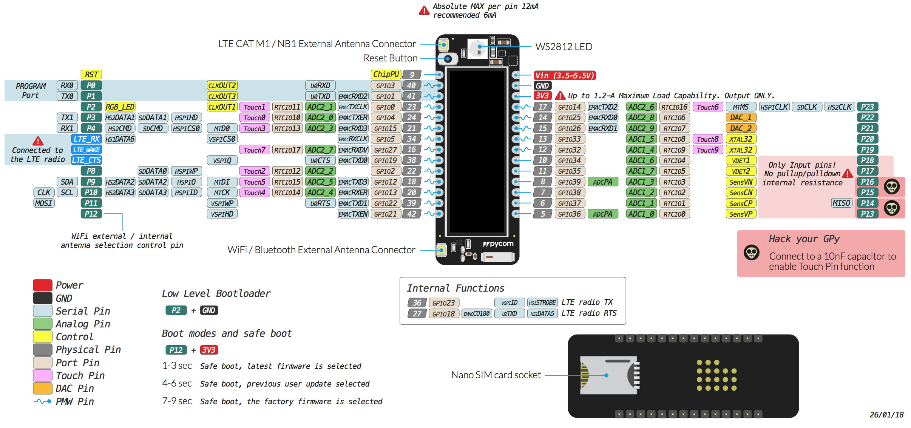
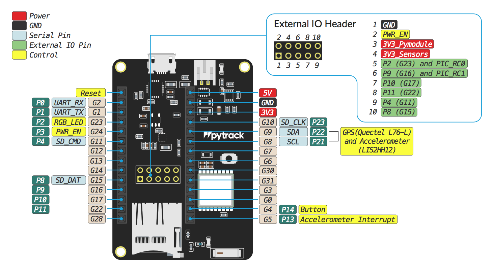

# Geo LTE Thermosense

## Abstract
This project involves the development of a device that uses a TMP117 temperature sensor, a 9000mAh battery, a Pycom Pytrack for GPS data and a Pycom Gpy for sending data over LTE using Queltel-L76 GNSS. The device is designed to send sensor data every 3 minutes and has a battery life of 9-12 months, making it ideal for long-term use in a variety of applications.

One potential use for this device is in the transportation industry, specifically for trucks that transport goods. The device can be used to monitor the temperature inside the truck, ensuring that the goods are being transported in a suitable environment. Additionally, the device can be used to track the location of the truck and monitor its movements, providing valuable data for logistics and supply chain management.

Another potential use for this device is in the medical industry, specifically for organ transport. The device can be used to monitor the temperature of the organ during transportation, ensuring that it remains at the appropriate temperature and is not damaged during transit. The device can also be used to track the location of the transport vehicle and provide real-time data to medical professionals, ensuring that the organ arrives at its destination safely and on time.

Other potential uses for this device include monitoring temperature and location in agricultural settings, such as in greenhouses or on farms, and monitoring temperature and location in industrial settings, such as in warehouses or factories. Overall, the versatility and long battery life of this device make it a valuable tool for a wide range of industries and applications.

## Docs
- [Project Requirements](./doc/requirements.md)
- [Server Communication Protocol](./doc/protocol.md)
- [Power Consumption spreadsheet](https://docs.google.com/spreadsheets/d/1yKt7jXkSbqm5DyMouLU8X8WFjGBCADySog3blvWz7OY/edit?usp=sharing)

## Todo

- [x] Sync time with RTC
- [x] Handle server communications using the defined protocol
  - [x] Write to config file
  - [x] Add firmware version and SD card status to heartbeat
- [x] Initial draft for the communications protocol [WIP]
- [x] LTE attaching/connecting timeout (default to 10 seconds)
- [x] Log to a file
- [x] Procedure for OTA updates
- [x] Implement OTA updates with protocol
- [x] Flashing custom firware (code security)
- [x] Figure out sending/receiving SMS
- [x] Enclosure

## Enclosure
The enclosure for the device was designed using Onshape, a cloud-based 3D CAD software, and 3D printed using an Ender 3 printer with PLA filament. The design of the enclosure ensures that the device is protected from the elements and can withstand harsh environmental conditions.



## Gpy Pinout   



## PyTrack Pinout



## Reset Cause values

```c
typedef enum {
    MPSLEEP_PWRON_RESET = 0,
    MPSLEEP_HARD_RESET,
    MPSLEEP_WDT_RESET,
    MPSLEEP_DEEPSLEEP_RESET,
    MPSLEEP_SOFT_RESET,
    MPSLEEP_BROWN_OUT_RESET,
} mpsleep_reset_cause_t;
```

## Resources

- pycom
  - [Offical pycom docs](https://docs.pycom.io)
  - [pycom libraries](https://github.com/pycom/pycom-libraries)
- MicroPython
  - [Official MicroPython docs](https://docs.micropython.org/en/latest/index.html)
  - [Guide to setup a new micropython project with vscode intellisense](https://lemariva.com/blog/2019/08/micropython-vsc-ide-intellisense)
- Ruuvi
  - [Ruuvi firmware](https://lab.ruuvi.com/ruuvitag-fw/)
  - [Ruuvi sensor protocols](https://github.com/ruuvi/ruuvi-sensor-protocols)
- GNSS/GPS Module (Quectel L76GNSS)
  - [L76 Series GNSS Protocol Specification](./doc/Quectel_L76_Series_GNSS_Protocol_Specification_V3.3.pdf)
  - [Commands manual](./doc/Quectel_GNSS_SDK_Commands_Manual_V1.4.pdf)
- LTE modem (Sequans Monarch LR5110)
  - [AT Commands Reference Manual](./doc/Monarch-LR5110-ATCmdRefMan-rev6_noConfidential.pdf)
- Firmware
  - [Pycom Micropython](https://github.com/pycom/pycom-micropython-sigfox)
- NIST
   - [NIST security requirements Summary](https://www.nist.gov/news-events/news/2019/08/nist-releases-draft-security-feature-recommendations-iot-devices)
   - [NIST security requirements for iot devices](https://nvlpubs.nist.gov/nistpubs/ir/2020/NIST.IR.8259.pdf)
   - [NIST traceable calibration](https://www.nist.gov/calibrations)

